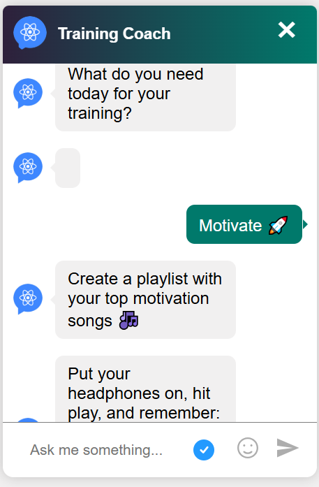

# Botonic Practice

This is a small test to explore how Botonic works - a framework for building conversational apps using React and AI. Just a personal learning practice to understand how conversational interfaces work, and how AI tools can help people feel more connected. 🌱

The idea is simple: a mini chat that asks the user what they need today to train - whether they want to focus or get motivated.

👉 Documentation: [https://botonic.io/docs/welcome/](https://botonic.io/docs/welcome/)  
👉 Botonic GitHub: [https://github.com/hubtype/botonic](https://github.com/hubtype/botonic)

## 🖼️ Chat Preview

